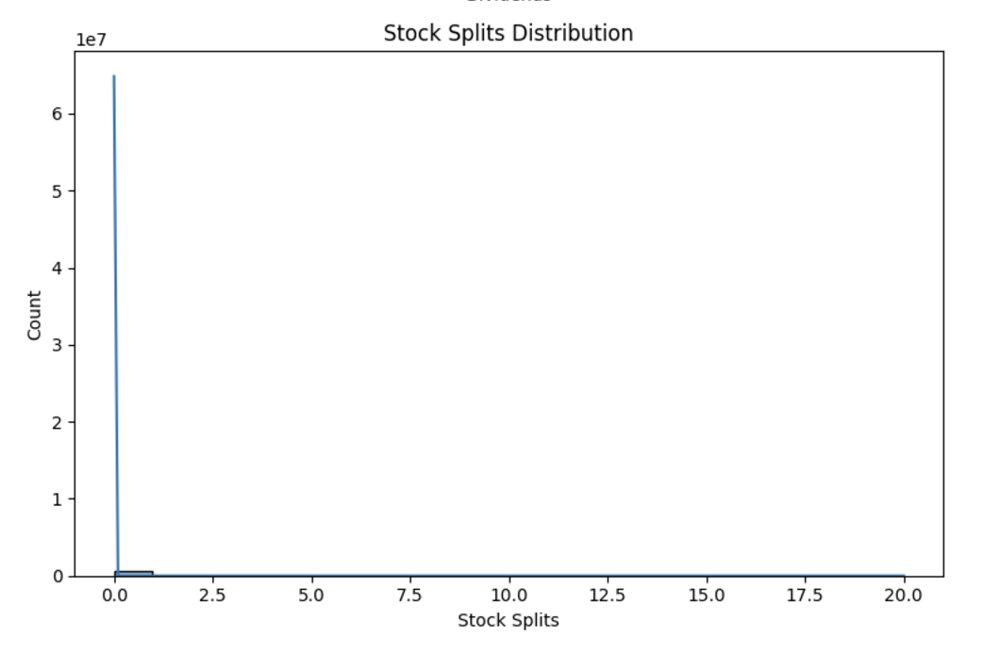

# CSE-151A Group Project - Milestone 5: Final Report

Link to Jupyter Notebook: [https://github.com/cs-151a/cs-151a/blob/Milestone5/stocks.ipynb](https://github.com/cs-151a/cs-151a/blob/Milestone5/stocks.ipynb)

## Introduction

For our project, we chose the S&P 500 as our dataset. The reason being is because it is one of the most important market benchmarks representing the largest US companies. We knew that it had extensive data available making it the ideal dataset to train models. The data is high quality and reliable compared to regular stocks which may contain gaps in the data or irregularities. In addition, the index is less volatile than individual stocks, making it easier to model. 

Now you may ask why this is cool. It is because it can help us track money and how we can add more money to our pockets. It is highly liquid and widely traded making any insights we receive highly applicable. On top of that by picking this dataset we get the “wisdom of the crowd” effect. Instead of focusing on a single company, we can capture the collective performance of the strongest corporate entities in the United States. These companies represent about 80% of the available market capitalization in the U.S. stock market. 

There is strong real-world impact and accessibility. Most people’s retirement is based on the 401ks that they receive which are heavily based on the S&P 500 funds. It’s the most common fund for benchmark performance. It represents rich data properties. The data can show interesting patterns both within the long term and the short term. It captures broader economic cycles and market sentiment, contains both rational price movements and emotional/behavioral aspects and has survived major historical events (crashes, recoveries, tech bubbles, financial crises). In essence, we can say that it is cool because we are not just modeling stocks. We are looking at the measure of American economic health that millions of people rely on for their economic well being. 

The models we chose for our project were the random forest regression model and the XGBoost model. When it comes to the random forest regression model, it serves as a good baseline model with reliable results. It handles non-linear relationships between the features and stock movements. Furthermore, it provides feature importance scores and also allows us to easily visualize the contribution of our various features. Finally, this model is relatively efficient computationally which was an added bonus.

Our second model was the XGBoost model. This was our more in depth model as it can capture non-linear relationships that the Linear Regression model might miss. It does a great job in handling complex interactions between features while generally providing better predictive performances compared to the Linear Regression model. It contains built-in feature importance metrics to understand what drives predictions. Due to these abilities, it is resistant to overfitting through regularization. 

These models help us go further with the S&P 500. Having a good predictive model has a broader impact that is quite significant. Using good models like ours, investors can better understand the risks of the market and identify new opportunities. Portfolio managers can improve their strategies with hedge funds. It can help the regular person comprehend which factors most influence market movements. In addition, it can be used to develop new trading strategies as well as risk management systems. In reality, it can help us innovate our trading strategies and help provide insights into the overall market behavior and the economic health of the United States of America.

## Methods
(All relevant code can be found in our notebook, linked above)

### Data Exploration

The dataset consisted of 602,962 rows and 9 columns, which included the following features:
- **Data** (object)
- **Open** (float64)
- **High** (float64)
- **Low** (float64)
- **Close** (float64)
- **Volume** (int64)
- **Dividends** (float64)
- **Stock Splits** (float64)
- **Company** (object)

The first five rows of the dataset were previewed for context. Additionally, a statistical summary of the numerical columns was generated, which highlighted significant variability in key financial metrics.

The dataset contained 491 unique companies, each identified by a ticker symbol (e.g., AAPL, MSFT, GOOGL, AMZN). Missing value checks confirmed that the dataset was complete with no missing values.

Several visualization techniques were employed to understand data distribution and relationships (figures for each are available in the “Results” section):

- A correlation heatmap was generated to identify linear relationships between numeric columns
- A pair plot was used to visualize relationships between features
- Distribution plots were created for individual numeric columns to analyze the spread and potential skewness
  
The exploration step provided insights into the dataset's structure and statistical patterns, setting the stage for further preprocessing and modeling

### Preprocessing

We took the following steps to preprocess our data for further modeling:

- **Dropped null and duplicate rows**
  - Any rows containing null values were removed to ensure data completeness
  - Any duplicate rows were dropped to eliminate redundant data

- **Removed irrelevant columns**
  - The "Dividends" and "Stock Splits" columns were dropped as they did not contribute to the analysis

- **Date conversion**
  - The "Date" column was converted from strings to datetime objects using Pandas’ to_datetime function with UTC specified. This allowed for better date-based calculations and sorting

- **Filtered out companies with insufficient data**
  - Stocks with less than three years of observations (measured between 2018 and 2024) were removed. Companies were filtered by checking for at least three consecutive years of data in the "Date" column

- **Feature scaling**
  - The numerical columns ("Open," "High," "Low," "Close," "Volume") were scaled using Min-Max Scaling to normalize values between 0 and 1. This ensured that all features contributed equally to the model

Next, we had to calculate financial metrics, such as returns and volatility, for each stock.

- **Daily Returns** (time-series representation of how each stock’s price changed each day)
  - Calculated as the percentage change in the “Close” column prices
  - Grouped by company

- **Annualized Return** (average annual performance of an investment)
  - Calculated by taking the mean of daily returns for each company and scaling it by 252 (approximate amount of trading days per year)

- **Annualized Volatility** (how much a stock price varies over a year)
  - Calculated by taking the standard deviation of daily returns, and scaling by 252

- **Risk-Adjusted Return** (measures profit of an investment without considering risk)
  - Calculated by dividing the annualized return by the annualized volatility

Finally, we used each of these financial metrics to calculate Sharpe Ratio for the dataset, a more comprehensive risk-adjusted metric:

- **Sharpe Ratio** (compares the return of an investment with its risk)
  - Calculated by dividing the annualized excess return by the annualized volatility

Ultimately, the preprocessing steps prepared the dataset by cleaning, scaling, and enriching it with essential financial metrics, such as daily returns, annualized returns, volatility, and Sharpe ratios. These transformations ensured that the data was both accurate and suitable for subsequent machine learning models.

### Model 1

#### Model Overview

The first model implemented was a Random Forest Regressor, chosen for its ability to handle non-linear relationships and provide feature importance scores.

#### Model Architecture

The Random Forest Regressor was configured with the following hyperparameters:

- n_estimators: 100
- max_depth: 10
- min_samples_split: 5
  
#### Data Preparation

- **Feature Selection**
  - The following weighted features were generated based on their importance to the target prediction:
    - Weighted_Risk_Adjusted_Return: 0.5
    - Weighted_Sharpe: 0.3
    - Weighted_Volatility: 0.2
    
- **Target Variable**
  - The target variable, Future_Return, was calculated as the mean future return over a 30-day period
  - Missing values in the target variable were filled using the median
  
- **Feature Scaling**
  - Features were scaled using a RobustScaler to handle outliers and ensure numerical stability
  
#### Training and Testing

- The dataset was split into training and testing sets using an 80:20 ratio with train_test_split
- The Random Forest Regressor was trained on the scaled features from the training set, and predictions were made on the testing set

### Model 2

#### Model Overview

The second model implemented was an XGBoost Regressor. This ensemble learning method was chosen for its efficiency in handling complex datasets and its ability to model non-linear relationships effectively.

#### Model Architecture

The XGBoost model was trained with the following hyperparameters:
- n_estimators: 200
- learning_rate: 0.1
- max_depth: 6
- min_child_weight: 1
- subsample: 0.8
- colsample_bytree: 0.8
- gamma: 0
  
These parameters were initially set before hyperparameter tuning, which is discussed later.

#### Data Preparation

- **Data Splitting**
  - The dataset was split into training (80%) and test (20%) subsets
    
- **Feature Scaling**
  - The data was scaled using the RobustScaler to mitigate the impact of outliers
    
#### Training and Testing

The model was trained using the following approach:

- **Cross-Validation**
  - Five-fold cross-validation was performed to assess the stability and robustness of the model
 
- **Model Fit**
  - The model was trained on the scaled training data and evaluated on the test set
    
#### Tuning and Hyperparameter Optimization

To optimize the model’s performance, a Grid Search approach was implemented. This method was used to find the optimal set of hyperparameters for the model, which will be discussed in the “Results” section for Model 2.

## Results

### Data Exploration

The results of the data exploration are summarized as follows:

- **Dataset Overview:**
  - Total rows: **602,962**
  - Columns: **9 features**, including both numeric and categorical data types
  - No missing values were found during the exploration

- **Statistical Summary:**
  - Additionally, the following is a statistical summary of the numerical columns. These statistics demonstrate significant variability in key financial metrics:

- **Unique Companies:**
  - The dataset included 491 unique companies, each identified by its ticker symbol (i.e. AAPL, MSFT, GOOGL, AMZN)

- **Missing Values:**
  - Following the statistical summary of our dataset, we checked for missing values. Luckily, our dataset was complete:

- **Visualization Results**
  - The **correlation heatmap** highlighted linear relationships, revealing potential multicollinearity between some features

  - The **pair plot** provided insights into feature interactions and trends between variables

  - **Distribution plots** showed the spread and skewness of numeric features, informing later preprocessing steps

The data exploration process provided us with a comprehensive understanding of the dataset structure, revealed no missing values, and helped identify statistical and visual trends essential for preprocessing and modeling.

### Preprocessing

#### Preprocessing Results

- **Data Cleaning**
  - A total of **601,438 rows** and **7 columns** remained after removing null and duplicate rows, as well as the unnecessary columns of our dataset

- **Filtered Data**
  - Stocks with less than three years of observations were filtered out. The dataset now includes **485 unique companies** with sufficient data between 2018 and 2024

- **Feature Scaling**
  - The numerical columns ("Open," "High," "Low," "Close," "Volume") were scaled using Min-Max Scaling

- **Financial Metrics**
  - The following metrics were calculated for each company:
    - **Daily Returns:** Representing the percentage change in the "Close" prices
    - **Annualized Return:** Average annual performance of each stock
    - **Annualized Volatility:** Standard deviation of daily returns over a year
    - **Risk-Adjusted Return:** Annualized return divided by volatility

 
#### Financial Metrics Results

- **Risk-Adjusted Metrics** (Annualized Return, Volatility, and Risk-Adjusted Return)
  - The top-ranked company based on **Risk-Adjusted Return** was NVO, with a score of **1.3123**. The next top companies included **LLY (1.2489)** and **SNPS (1.2337)**
  - The lowest-ranked company based on Risk-Adjusted Return was **CPNG**, with a score of **-0.3161**

- **Sharpe Ratio**
  - The **Sharpe Ratio** for the dataset was calculated as **0.3618**, representing the return relative to the risk for the entire dataset
  - A breakdown of Sharpe Ratios for individual companies shows a wide range, highlighting varying levels of risk and return tradeoffs

- **Excess Returns and Volatility**
  - The **Annualized Excess Return** was **0.1503**, and the **Annualized Volatility** was **0.4156**.

- **Sharpe Ratio per Transaction**
  - Each transaction was annotated with the calculated Sharpe Ratio, providing a per-transaction risk-adjusted performance metric.

### Model 1

#### Model Performance

The Random Forest Regressor was evaluated on the testing set, yielding the following metrics:

- **Mean Squared Error (MSE)**: 0.00001233
- **Mean Absolute Error (MAE)**: 0.00236058
- **Root Mean Squared Error (RMSE)**: 0.00351094
- **R-squared (R²)**: 0.96112761
- **Explained Variance Score**: 0.96126630
  
These results indicate that the model achieved high accuracy and explained over 96% of the variance in the target variable.

#### Feature Importance

The Random Forest model identified the following rankings for feature importance:

1. **Weighted_Sharpe**: Most influential, contributing **71.9%** of importance
2. **Weighted_Volatility**: Moderate influence, contributing **23.9%**
3. **Weighted_Risk_Adjusted_Return**: Least influential, contributing **4.1%**
   
The dominant influence of **Weighted_Sharpe** highlights its role in driving predictive accuracy for future returns.

#### Feature Statistics

The features used in the model exhibited the following descriptive statistics:

- **Weighted_Risk_Adjusted_Return**:
  - Mean: 0.255, Std: 0.133
  - Min: -0.158, Max: 0.656
    
- **Weighted_Sharpe**:
  - Mean: 0.110, Std: 0.081
  - Min: -0.125, Max: 0.342
    
- **Weighted_Volatility**:
  - Mean: 0.078, Std: 0.032
  - Min: 0.024, Max: 0.426
    
These statistics provide insights into the spread and range of key input features.

#### Classification Results

The classification model performance metrics at a threshold of **0.0198** are as follows:

- **True Positives (TP)**: 45
- **True Negatives (TN)**: 45
- **False Positives (FP)**: 3
- **False Negatives (FN)**: 4
- **Accuracy**: 92.78%
  
This reflects robust performance in identifying stocks with strong potential while minimizing misclassifications.

#### Stock Rankings

**Top 10 Stocks by Score**:

- **LYG**: 1.000
- **SYM**: 0.781
- **UMC**: 0.733
- **NVDA**: 0.699
- **NVO**: 0.655
- **CARR**: 0.640
- **BNTX**: 0.617
- **SNPS**: 0.608
- **LLY**: 0.603
- **TSLA**: 0.597
  
**Bottom 10 Stocks by Score**:

- **MMM**: -1.000
- **VZ**: -0.895
- **CPNG**: -0.873
- **VOD**: -0.871
- **TAK**: -0.838
- **IFF**: -0.809
- **FIS**: -0.797
- **D**: -0.792
- **WBD**: -0.754
- **PFE**: -0.743
  
#### Summary of Key Findings

- The high R² (0.9611) and low error metrics (MSE and MAE) demonstrate the Random Forest model's strong predictive performance

- The classification accuracy of **92.78%** further validates the model's robustness

- **Weighted_Sharpe** emerged as the most critical feature, underscoring its predictive importance for future stock performance

- Stocks such as **LYG**, **SYM**, and **NVDA** were identified as top performers, while **MMM**, **VZ**, and **CPNG** were the lowest-ranked

These findings provide actionable insights for investment decision-making based on the model's outputs.

### Model 2

#### Model Performance

The XGBoost Regressor was evaluated on the test set, yielding the following metrics:

- **Mean Squared Error (MSE)**: 0.00001517
- **R-squared (R²)**: 0.95140264

These results indicate that the model achieved high accuracy and explained over 95% of the variance in the target variable.

#### Feature Importance

The XGBoost model identified the following rankings for feature importance:

- **Sharpe Ratio (medium)**: Most influential, contributing 39.18% of importance
- **Sharpe Ratio (high)**: Moderate influence, contributing 27.97%
- **Sharpe Ratio (low)**: Moderate influence, contributing 19.31%
- **Volatility (medium)**: Moderate influence, contributing 5.34%
- **Volatility (high)**: Moderate influence, contributing 4.12%
- **Risk (medium)**: Lesser influence, contributing 1.58%
- **Risk (high)**: Lesser influence, contributing 1.33%
- **Volatility (low)**: Lesser influence, contributing 0.86%
- **Risk (low)**: Least influential, contributing 0.31%

The dominant influence of **Sharpe Ratio (low)** underscores its critical role in driving the model’s predictions of stock returns.

#### Cross-Validation Performance

The model underwent five-fold cross-validation with the following results:

- **Cross-validation scores**: [0.94179683 0.92022365 0.93016131 0.9374729  0.8912428]
- **Mean Cross-validation score**: 0.9242

These results demonstrate the model’s stability and consistency across different training sets.

#### Stock Rankings

**Top 10 Predicted Stocks by Return:**

- **TSLA**: 9.11%
- **NVDA**: 7.81%
- **SYM**: 7.7%
- **MRNA**: 7.61%
- **BNTX**: 7.58%
- **NET**: 7.2%
- **PDD**: 6.96%
- **TTD**: 6.7%
- **MDB**: 6.63%
- **PLTR**: 6.55%

**Bottom 10 Predicted Stocks by Return:**

- **CPNG**: -3.13%
- **WBD**: -1.67%
- **MMM**: -1.62%
- **BEKE**: -1.24%
- **FIS**: -0.9%
- **VOD**: -0.75%
- **DASH**: -0.72%
- **RBLX**: -0.72%
- **IFF**: -0.62%
- **COIN**: -0.6%

#### Best Hyperparameters

The best hyperparameters found through Grid Search optimization were:

- **n_estimators**: 300
- **max_depth**: 4
- **learning_rate**: 0.05
- **min_child_weight**: 1
- **subsample**: 0.7
- **colsample_bytree**: 0.7
- **gamma**: 0

These hyperparameters optimized the model's performance.

#### Model Evaluation Metrics

The model’s evaluation metrics are as follows:

- **Training Error (MSE)**: 0.000001
- **Test Error (MSE)**: 0.000015
- **Training R-squared**: 0.9945
- **Test R-squared**: 0.9528
- **MSE Difference (Train-Test)**: 0.000013

The model's performance on the test set indicates minimal overfitting and strong predictive power.

#### Classification Results

At a threshold of **0.0192**, the model's classification performance was:

- **True Positives (TP)**: 232
- **True Negatives (TN)**: 234
- **False Positives (FP)**: 10
- **False Negatives (FN)**: 9
- **Correct Predictions**: 466

The classification results reflect the model’s ability to correctly identify positive predictions while minimizing false positives.

#### Summary of Key Findings

- The **R² score** of **0.95275246** and **MSE** of **0.00001475** demonstrate the model’s strong predictive performance
- **Sharpe Ratio (low)** emerged as the most influential feature, highlighting its importance in predicting stock returns
- The model’s **classification accuracy** is strong, with **466 correct predictions** and minimal false positives
- **Top-performing stocks** like TSLA, NVDA, and SYM show a strong predicted return, while stocks such as MMM, WBD, and CPNG are among the lowest-ranked

These results offer valuable insights for investment decision-making based on the model's outputs.

## Discussion

### Data Exploration 

Our choice to use the S&P 500 dataset was both an advantage and a limitation. The quality of our dataset was excellent which was why we chose it. There were no missing values, allowing us to avoid common data quality issues. However, our dataset gave us a somewhat idealized view of market behavior, as real-world trading often involves dealing with incomplete or inconsistent data.
The presence of 491 unique companies provided a robust sample size, but it's worth noting that this represents a specific subset of the global economic market. These companies in particular are large, successful, and well-established. This selection bias means our models might not generalize well to smaller or emerging companies. Additionally, while having 602,962 rows of data suggests comprehensive coverage, it also presents challenges in terms of computational efficiency and the risk of overfitting.
The correlation heatmap revealed strong relationships between certain financial metrics, particularly between Open, High, Low, and Close prices. While these correlations were expected, they raised concerns about multicollinearity in our modeling approach. We could have potentially simplified our feature set by selecting fewer price indicators without significantly losing predictive power.
Our distribution plots showed significant skewness in several features, particularly in Volume. In retrospect, we could have applied more sophisticated transformation techniques beyond simple scaling to address these distributional issues. The presence of extreme outliers, especially in Volume data, might have negatively influenced our models despite our scaling efforts.

### Preprocessing

For preprocessing of our data, we made cautious choices to comb through our data and ensure that it was in the best state prior to training our models. The decision to remove stocks with less than three years of financial data helped ensure stability in our analysis but potentially eliminated emerging companies that might have shown interesting patterns or opportunities such as KVUE, a Johnson & Johnson spinoff with over $15 billion in revenue.
We used a plethora of calculated financial metrics that followed industry trends. Many financial firms and traders use risk-adjusted return, annualized volatility, and Sharpe ratio as they ponder over their next financial moves, and we took inspiration from that. However, our approach to annualization using an average of 252 trading days might be an oversimplification. Market conditions can vary significantly year by year, and a more dynamic approach to annualization might have better captured these variations.
The use of Min-Max scaling for numerical features was effective for standardization but potentially sensitive to outliers. A more robust scaling approach, such as Winsorization followed by standardization, might have better handled extreme values while preserving important market signals.
Our approach to calculating the Sharpe Ratio used a simplified risk-free rate assumption. In practice, the risk-free rate varies over time, and incorporating a dynamic risk-free rate might have provided more accurate risk-adjusted return calculations.

### Model 1

The Random Forest model's impressive R-squared value of 0.96 raises some concerns about potential overfitting, despite cross-validation efforts. 
The dominance of Weighted_Sharpe (71.9% importance) in feature importance suggests our model might be overly reliant on this metric. While the Sharpe ratio is indeed a valuable indicator, such heavy dependence on a single feature could make the model vulnerable to market conditions where this metric becomes less reliable.
The classification accuracy of 92.78% is remarkably high, perhaps a little too high for financial market prediction. This could indicate a variety of possibilities such as possible data leakage, overfitting to historical patterns, or insufficient testing on out-of-sample data.
The model's hyperparameters (100 trees, max_depth of 10) might have been too simplistic. A more thorough hyperparameter optimization process, perhaps using Bayesian optimization, could have yielded more robust results.

### Model 2

The XGBoost model also yielded high performance metrics, albeit with some interesting differences in feature importance distribution. The more balanced distribution of importance across different Sharpe Ratio categories (low, medium, high) suggests a more nuanced capture of market conditions.
However, several critical points must be addressed.
The model's heavy reliance on Sharpe Ratio variations (combined 87.15% importance) suggests potential redundancy. We might have created features that were too similar, leading to artificial performance improvements.
The cross-validation scores showed some variance (ranging from 0.8912 to 0.9417), indicating that model performance might be sensitive to the specific time periods used for training and testing. This volatility in performance metrics suggests that the model might not be as robust as the aggregate metrics indicate. The classification results, while strong, might be optimistic due to the use of a basic threshold (0.0192) for classification, possible look-ahead bias in feature construction, and lastly limited testing across different market conditions

Both models show strong performance metrics but might be too optimistic for real-world application. The high accuracy rates suggest that either we've discovered an unusually effective approach to market prediction (unlikely), or there are hidden biases/limitations in our methodology that warrant further investigation (more likely).
Future improvements could include: incorporating macroeconomic indicators, testing model performance across different market regimes, implementing more sophisticated feature selection methods, adding regularization techniques to combat overfitting, and testing with more recent, out-of-sample data to verify generalization
While both models show promising results, their very high performance metrics suggest we should approach these results with healthy skepticism. The real test would be their performance in live market conditions, particularly during periods of market stress or regime changes not represented in our training data.

## Conclusion

Wrapping things up, our analysis of the S&P 500 index using advanced machine learning technologies, particularly Random Forest and XGBoost, attests to the immense possibilities lying in the data-centric approach to trading and investment. An index that is so widely followed and deeply analyzed lends a certain robustness, generality, and application to our modeling attempts compared to individual stock picks. The preprocessing we did, cleaning and normalization of data, plus computations reporting sophisticated quality metrics helped ensure that the inputs into our models were acceptable and reliable.

However, despite these encouraging results, there is a need for caution and reflection. Achieving consistently high R² values greater than 0.90 in finance is an act one needs to tread on cautiously, our method may be capturing patterns others would deem too good to be true in the real world. The high values indicate possible problems such as overfitting, the need for stricter validation procedures, or the necessity to employ out-of-sample and out-of-time tests.

The richness of features that work can be furthered with macroeconomic indicators such as interest rates, unemployment data, and GDP growth, as well as other alternative data sources such as news sentiment, social media trends, and insider trading activities, instead of focusing solely on sector signals. We might also investigate many diverse modeling techniques in the future, such as neural networks, convolutional methods for time series data, or even fiscal ensemble strategies, which combine the best of several algorithms. Bayesian optimization or other algorithms for hyperparameter tuning can push performance slightly higher while working to mitigate overfitting.

Moreover, we would have to consider more complex evaluation strategies. A combination of rigorous regression metrics, rolling windows, walk-forward validation, and true out-of-time test splitting would provide a more realistic sense of how these models would operate in the actual markets. This would build confidence in the result and lend itself more credibility in front of traders and portfolio managers. We would also note that the selection of metrics and methods can determine the success of such models. The Sharpe ratio, as we noted, stood out as one of the few parameters with sound predictive power for risk-adjusted returns. If we had to do it over again, we might investigate other advanced financial metrics—such as the Sortino ratio, Calmar ratio, and drawdown analysis—to obtain a more holistic view of market drivers. Incorporating transaction costs, liquidity constraints, and execution drags would enhance realistic trading action.

Real-life implications cannot be overestimated. Historically, successful quantitative strategies have empowered firms like Citadel and other leading hedge funds to make gigantic profits that dwarfed those based on human intuition. The very real application of AI and ML in trading is not just about reaching a new echelon of financial innovation but gaining a deep understanding of the cruel reality of today’s markets. As the algorithms grow in sophistication, incorporating machine-learned aid into investment decision-making will soon become an everyday norm rather than an indulgence of those within the top-tier institutions. When applied appropriately, such mechanisms have the capability to help investors of all sizes maneuver through complexity, locate unseen opportunities, and manage risk more effectively.

In essence, the study shows that we have made commendable headway toward building robust models, yet the road ahead remains open to vast growth and exploration. Future efforts will probably involve deeper data, selective features, improved validation methods, and the application of pioneering algorithms. If we were to further invest our time and resources into these models, we can gain new information regarding the status of today’s market. And if deployed wisely, these models might endow the very advantage needed to cruise through the tumultuous environment of modern finance—the same way Citadel has displayed to the world that it is indeed possible.

## Statement of Collaboration

We contributed to this project as a team. Individual contribution is as follows:

- Sean Tran (Data Preprocessing, Model Creation, Evaluation)
  - For Milestone 1, help find data set and reviewed abstract 
  - For Milestone 2, helped with coming up with ideas for prepossessing out code, coming up with potential limitations and solutions. I also reviewed and evaluated the code
  - For Milestone 3-5, helped with creating the model and the specific functions its used including prediction risk adjustment return. Also helped with coming up with ideas for models and reviewing results. For Milestone 5 I created the “Visualizations” that are found throughout the paper and contributed to the classification results. Reading additional machine learning papers to learn more about what was needed. And did the final read through evaluation.

- Jonathan Zhang (Data Preprocessing, Project Manager, Initial Setup)
  - For MS 1, I found the initial dataset because I’m passionate about stocks and trading. I wrote the initial abstract and submitted it. 
  - For MS 2, I created the GitHub organization and set everything up. I helped with the data exploration step and uploaded the initial code to our repo.
  - For MS 3, I split the milestone into appropriately sized tasks for all members. I decided upon which three features we were going to use, what their mathematical representation looked like, and helped to code up one of the features as well. 
  - For MS 4, I was once again in charge of planning and distributing tasks for everyone. I tried to optimize the new model as well as answer some questions in the README. I also edited the README for clarity before submission. 
  - For MS 5, I split tasks again, wrote a portion of the written report, and made edits on everyone’s work to ensure clarity and quality. 

- Ryan Seidl (Data Preprocessing, Model Evaluation)
  - For Milestone 2, I helped brainstorm how we should go about preprocessing our dataset. Additionally, I contributed to writing the preprocessing code, which we would go on to use for our two models.
  - For Milestones 3-5, I was in charge of evaluating our models and reporting the metrics and statistics related to model performance. For Milestones 3 and 4, this included analyzing the results of each model, explaining how they fit in the fitting graph, and describing the next models we were thinking about creating. For Milestone 5, I wrote the “Methods” and “Results” sections in our final report, describing how we went about data exploration, preprocessing, building model 1, and building model 2, as well as the results of each of these processes.

- Can Yavuz (Data Preprocessing, Model Creation) 
  - For milestone 2 I contributed to the preprocessing strategy and how we could go about it. I looked over the code once it was finished and made sure that it matched the rubric.
  - For Milestones 3-5 I was the one who created both of our models. I created our linear regression model for milestone 3 and printed out its metrics. For milestone 4 I researched for potentially better models than the linear regression model we had and found the XGBoost model. I learned how to use it,  created our new model and trained it. For milestone 5 I wrote the introduction to the project explaining why we picked the data we did, why it is cool and why it is important. 

- Daniel Hwang (Data Preprocessing, Model Evaluation, Notebook Revisions)
  - For Milestone 2 I helped the group explore the basic dataset and how we could go about finding features. I also contributed to the preprocessing plan of our group to do later in Milestone 3.
  - For Milestone 3 I developed the basic preprocessing and formatting of the dataset to be used in the model. I also reviewed and revised the notebook throughout the process.
  - For Milestone 4 I assisted in the evaluation of our new model as well as printing out figures for us to include in the README. Like Milestone 3, I reviewed and revised the notebook throughout the process.
  - For Milestone 5 I fixed some of the issues we had with our code (missing information, abnormal graph, uneven dataset). I also helped in looking through and making sure our final report met all the requirements.

- Idhant Das (Metrics calculation, Notebook revision)
  - For Milestone 2, I helped review the abstract and the preprocessing of data.
  - For Milestone 3,  I also wrote code to calculate and output the sharpe ratio.
  - For Milestone 4, I wrote code that would calculate and output training and testing metrics MSE and R2 values.
  - For Milestone 5, I wrote the conclusion section of the report and reviewed the report and code to make sure that there were no errors in the final submission.

